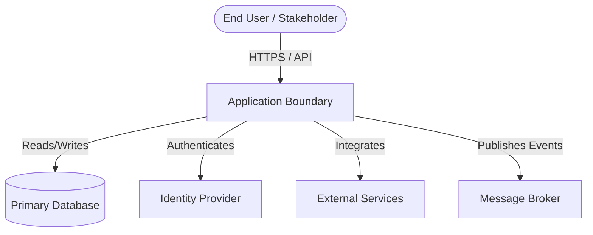
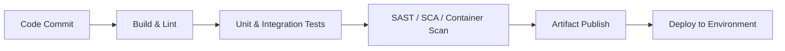

# Application Architecture & Technology Document: {{APPLICATION_ACRONYM}} - {{APPLICATION_NAME}}

This document provides a comprehensive blueprint and technology assessment of **{{APPLICATION_NAME}} ({{APPLICATION_ACRONYM}})**. It is designed to be maintained, verified, and parsed by the Architecture Review Agent to ensure architectural standards, security policies, and technical currency are continuously verified.

---

## Revision History

| Version | Date | Author | Changes |
| :--- | :--- | :--- | :--- |
| `1.0` | `YYYY-MM-DD` | `Architecture Review Agent` | `Initial generation` |

---

## 1. Metadata & Organizational Alignment

| Metadata Field | Value / Description |
| :--- | :--- |
| **Application Acronym** | |
| **Full Application Name** | |
| **Status** | `[Active / In Development / Maintenance / Decommissioned]` |
| **Ministry** | |
| **Division** | |

---

## 2. System Overview & Boundaries

### 2.1 Capability Statement
*Provide a concise 2-3 sentence summary explaining the core business problem this application solves, who its users are, and its primary capabilities.*

### 2.2 System Context Diagram
*Use a Mermaid diagram to visualize the high-level boundary of the application, key user flows, and core external integrations. Replace the example below with the actual application context.*



### 2.3 Platform role, reuse, and data responsibility

Complete this section only when the platform-alignment module is routed. Select
one role from that module, or record `Unknown` when repository evidence is
insufficient. Do not invent a shared-service catalogue.

| Assessment | Result | Evidence / Owner | Confidence |
| :--- | :--- | :--- | :--- |
| **Conditional role** | `Public service / Shared platform / Canonical register / Internal system / Point solution / Integration adapter / Unknown` | | `Verified / Inferred / Unknown / N/A` |
| **One-to-many impact** | `Single consumer / Multiple consumers / Unknown` | | `Verified / Inferred / Unknown / N/A` |
| **Reuse or build decision** | | Discovery performed and accountable owner | `Verified / Inferred / Unknown / N/A` |
| **Data custodian and permitted purpose/subject scope** | | | `Verified / Inferred / Unknown / N/A` |
| **Data sharing spectrum** | `Open / Shared / Closed / Unknown` | Classification conditions | `Verified / Inferred / Unknown / N/A` |
| **Narrow question API vs. broad data access** | | | `Verified / Inferred / Unknown / N/A` |

For one-to-many capabilities, document consumer support, capacity/SLO
expectations, compatibility notifications, and the consequence of a change.

---

## 3. Logical & Structural Component Breakdown

This section documents the actual project structure and highlights the real architectural boundaries (modules, packages, and code boundaries).

```
# Represent the key boundaries / packages using a relative file-tree layout
```

### 3.1 Key Architecture Seams
*Identify the de-facto software modules via import-graph or dependency clustering. This reveals actual functional cohesions that might span multiple directories.*

* **Cluster 1:** `[Name]`
  * *Key Components:* 
  * *Purpose:* 
* **Cluster 2:** `[Name]`
  * *Key Components:* 
  * *Purpose:* 

### 3.2 Entry Points & Gateways
*List the explicit gateways or entry points to the application logic (e.g., REST API controllers, background workers, event listeners, CLI commands).*

| Entry Point | Type | Path / Reference |
| :--- | :--- | :--- |
| | `REST API / gRPC / GraphQL / CLI / Worker / Event Consumer` | |

---

## 4. API Surface & Contracts

### 4.1 API Versioning Strategy
*Document the API versioning approach (URL path, header, query parameter) and the current active versions.*

| API Version | Status | Base Path / Header | Sunset Date |
| :--- | :--- | :--- | :--- |
| | `Active / Deprecated / Sunset` | | |

### 4.2 Contract Documentation
*Reference OpenAPI/Swagger specs, AsyncAPI definitions, or GraphQL schemas.*

| Contract Type | Location | Auto-Generated |
| :--- | :--- | :--- |
| | | `Yes / No` |

### 4.3 Contract Testing
*Document any consumer-driven contract tests (Pact, Spring Cloud Contract, etc.) or schema validation pipelines.*

### 4.4 Contract ownership and dependency behavior

| Contract / Dependency | Owner | Version / compatibility policy | Timeout, cancellation, retry and idempotency | Fallback, stale-data and rollback behavior |
| :--- | :--- | :--- | :--- | :--- |
| | | | | |

Document whether a dependency failure fails closed, queues work, serves clearly
marked stale data, or uses an assisted path. Fallbacks must not silently weaken
authorization, identity assurance, data minimization, or auditability.

---

## 5. Unicode, UTF-8 & Indigenous-Language Readiness

*Document the end-to-end ability to receive, store, process, search, transmit, display, export, and print Indigenous-language and multilingual text without corruption.*

| Boundary | Encoding / Unicode Type | Collation / Comparison | Round-Trip Evidence | Status |
| :--- | :--- | :--- | :--- | :--- |
| UI and HTTP input/output | | | | `Verified / Gap / Unknown / N/A` |
| Application processing and validation | | | | `Verified / Gap / Unknown / N/A` |
| Database, indexes, and search | | | | `Verified / Gap / Unknown / N/A` |
| Messages, caches, and integrations | | | | `Verified / Gap / Unknown / N/A` |
| Files, imports, exports, reports, and printing | | | | `Verified / Gap / Unknown / N/A` |
| Runtime globalization data and fonts | | | | `Verified / Gap / Unknown / N/A` |

- **Normalization policy:**
- **Identifier vs. linguistic comparison policy:**
- **Grapheme-aware operations:**
- **Known incompatible downstream systems and migration plan:**
- **Representative Indigenous-language test corpus:**

---

## 6. Security Architecture

This section defines the security posture, authentication/authorization model, cryptographic controls, and compliance assertions.

### 6.1 Authentication & Authorization Model
*Describe how users and services authenticate to this application and how authorization decisions are made.*

| Aspect | Implementation |
| :--- | :--- |
| **Authentication Method** | `OAuth2 / OIDC / SAML / API Key / PAT / mTLS` |
| **Identity Provider** | |
| **Authorization Model** | `RBAC / ABAC / Policy-based / ACL` |
| **Token Format** | `JWT / Opaque / Session Cookie` |
| **Token Storage** | `HttpOnly Cookie / Header / Secure Store` |

### 6.2 Cryptographic Controls
- **Secret Generation:** All tokens, keys, and nonces **MUST** be generated using cryptographically secure pseudorandom number generators (e.g., `RandomNumberGenerator`, `crypto.randomBytes`, `/dev/urandom`).
- **Transience of Secrets:** Plaintext secret values **MUST** reside strictly in transit or volatile memory. They **MUST NEVER** be stored in cleartext in the database, configuration files, environment variables persisted to disk, or log outputs.
- **Credential Storage:** Only one-way hashes (minimum SHA-256, prefer bcrypt/scrypt/Argon2 for passwords) are persisted in credential stores.
- **Side-Channel Mitigation:** Authentication validation **MUST** use constant-time comparison or introduce artificial uniform delays on rejection paths to prevent timing attacks.

### 6.3 Concurrency & Data Integrity
- **Lock Granularity:** Prefer localized (per-resource/per-user) locks over global process-wide locks. Concurrent read operations **MUST NOT** be blocked by unrelated write locks.
- **Race Condition Prevention:** Multi-step privilege alterations **MUST** execute atomically within a single lock boundary or transaction to prevent TOCTOU races.
- **DB-Level Invariants:** For uniqueness constraints under concurrency, prefer database-level partial unique indexes over application-level check-then-act patterns.

### 6.4 Audit & Logging
- **Structured Audit Events:** Security-relevant state changes (role mutations, credential lifecycle events, data deletions) **MUST** emit structured `[AUDIT]` log entries.
- **PII Redaction:** Audit entries **MUST** reference entities by hashed identifiers or UUIDs only. Zero cleartext secrets, tokens, or personally identifiable information in log streams.

### 6.5 Data Classification
*Identify the sensitivity tiers of data handled by this application.*

| Data Category | Classification | Encryption at Rest | Encryption in Transit | Retention Policy |
| :--- | :--- | :--- | :--- | :--- |
| | `Public / Internal / Confidential / Restricted` | `Yes / No / N/A` | `TLS 1.2+ / mTLS` | |

---

## 7. Deployment & Infrastructure

### 7.1 Environment Topology

| Environment | Purpose | Hosting | URL / Endpoint |
| :--- | :--- | :--- | :--- |
| **Development** | Local / feature testing | | |
| **Test / QA** | Integration & acceptance | | |
| **Staging** | Pre-production validation | | |
| **Production** | Live workload | | |

### 7.2 CI/CD Pipeline
*Document the build, test, and deployment pipeline.*



| Pipeline Aspect | Details |
| :--- | :--- |
| **CI Platform** | `Azure DevOps / GitHub Actions / Jenkins / GitLab CI` |
| **Artifact Registry** | |
| **Deployment Strategy** | `Rolling / Blue-Green / Canary / Recreate` |
| **Infrastructure-as-Code** | `Terraform / Bicep / Helm / Pulumi / None` |

### 7.3 Container & Orchestration

| Aspect | Details |
| :--- | :--- |
| **Container Runtime** | `Docker / Podman / None` |
| **Base Image** | |
| **Orchestration** | `Kubernetes / OpenShift / ECS / App Service / None` |
| **Service Mesh** | `Istio / Linkerd / None` |

---

## 8. Observability

### 8.1 Logging
| Aspect | Details |
| :--- | :--- |
| **Framework** | `Serilog / NLog / log4j / Winston / stdlib` |
| **Aggregation** | `ELK / Splunk / Azure Monitor / CloudWatch / Loki` |
| **Structured Format** | `JSON / plaintext` |
| **Correlation ID** | `Yes / No` |

### 8.2 Metrics & Monitoring
| Aspect | Details |
| :--- | :--- |
| **Metrics Library** | `Prometheus / OpenTelemetry / App Insights / StatsD` |
| **Dashboard** | `Grafana / Azure Dashboard / Datadog / None` |
| **Key SLIs** | *List: latency p95, error rate, throughput, saturation* |

### 8.3 Distributed Tracing
| Aspect | Details |
| :--- | :--- |
| **Tracing Library** | `OpenTelemetry / Jaeger / Zipkin / App Insights / None` |
| **Propagation** | `W3C TraceContext / B3 / None` |

### 8.4 Health Checks & Alerts
| Endpoint / Check | Purpose | Alert Threshold |
| :--- | :--- | :--- |
| `/health` or `/healthz` | Liveness | |
| `/ready` | Readiness | |

---

## 9. Resilience & Disaster Recovery

| Aspect | Details |
| :--- | :--- |
| **RTO (Recovery Time Objective)** | |
| **RPO (Recovery Point Objective)** | |
| **Backup Strategy** | `Automated snapshots / Replication / Manual / None` |
| **Backup Frequency** | |
| **Failover Mechanism** | `Active-Active / Active-Passive / Manual / None` |
| **Graceful Degradation** | *Describe circuit breaker, retry, and fallback patterns* |
| **Chaos/Resilience Testing** | `Yes / No` |

---

## 10. Architecture Decision Records (ADRs)

Key architectural decisions are recorded to capture history and trade-offs.

| ADR ID | Title / Theme | Status | Date | Reference |
| :--- | :--- | :--- | :--- | :--- |
| | | `Proposed / Approved / Deprecated / Superseded` | | |

---

## 11. Architecture Review Agent Verification & Compliance Checklist

*This section provides a checklist utilized by the Architecture Verification Agent to validate codebase alignment. Each item is annotated with its verification confidence.*

### Confidence Legend
- **Verified** — Confirmed by direct evidence in source code or configuration.
- **Inferred** — Deduced from directory structure, naming conventions, or partial evidence.
- **Unknown** — Could not be determined; requires manual review.
- **N/A** — Not applicable to this application's architecture.

### Checklist

- [ ] **Technical Currency:** All core runtimes and database engines are within active support phases. No EOL platforms in production. `[Confidence: ]`
- [ ] **Unicode End-to-End:** Representative Indigenous-language text round-trips through input, storage, processing, search/integration, export, and rendering without loss. `[Confidence: ]`
- [ ] **Globalization Runtime:** Production hosts/images include required ICU/CLDR, locale, timezone, and font assets; invariant globalization is not used where culture-aware behavior is required. `[Confidence: ]`
- [ ] **No Hardcoded Credentials:** Zero secret or token literals exist in source code commits. `[Confidence: ]`
- [ ] **Cryptographic Controls:** Secret generation uses secure RNG; credentials are hashed before storage. `[Confidence: ]`
- [ ] **Side-Channel Defenses:** Authentication paths use constant-time comparison or artificial timing normalization. `[Confidence: ]`
- [ ] **Audit Logging:** Structured `[AUDIT]` events emitted for security-relevant state transitions. `[Confidence: ]`
- [ ] **Concurrency Safety:** Shared resource modifications are protected by appropriate lock granularity or transactional boundaries. `[Confidence: ]`
- [ ] **Dependency Health:** No critical/high CVEs in direct dependencies. License compliance verified. `[Confidence: ]`
- [ ] **Observability:** Health endpoints, structured logging, and alerting are configured. `[Confidence: ]`
- [ ] **Deployment Pipeline:** CI/CD includes automated tests and security scanning gates. `[Confidence: ]`
- [ ] **Data Classification:** Sensitive data categories are identified with appropriate encryption and retention controls. `[Confidence: ]`
- [ ] **Disaster Recovery:** Backup and recovery procedures are documented and tested. `[Confidence: ]`
- [ ] **Platform Role (conditional):** Where shared, public, canonical, or adapter evidence exists, one role is classified and one-to-many impact and reuse decisions are recorded; otherwise the result is `N/A` or `Unknown` with a reason. `[Confidence: ]`
- [ ] **Platform Data Responsibility (conditional):** Data custodian, permitted purpose/subject scope, narrow-question versus broad-data access, and the `Open / Shared / Closed` spectrum are evidenced. `[Confidence: ]`
- [ ] **Contract Ownership (conditional):** External contracts have an owner, compatibility/versioning and deprecation policy, consumer migration path, and rollback evidence. `[Confidence: ]`
- [ ] **Dependency Degradation (conditional):** Timeouts, cancellation, bounded retries, idempotency, fallback/staleness, and observable audit/provenance behavior are documented and tested where applicable. `[Confidence: ]`
- [ ] **Protected Resources and Access Paths (conditional):** Meaningful protected resources and person-to-application, service-to-service, administrator-to-platform, or partner access paths are inventoried where applicable. `[Confidence: ]`
- [ ] **Resource Authorization (conditional):** Authorization is enforced for the requested resource and action separately from authentication, with the enforcement point identified. `[Confidence: ]`
- [ ] **Least Privilege and Lifetime (conditional):** Scope, audience, capability, workload identity, and access duration are minimized and attributable where applicable. `[Confidence: ]`
- [ ] **Revocation and Exceptions (conditional):** Expiry, revocation, rotation, replay handling, and time-bound exceptions are defined for the applicable boundary. `[Confidence: ]`
- [ ] **Safe Degradation and Evidence (conditional):** Dependency failures do not silently expand privilege, and privacy-preserving decision evidence and confidence are recorded where observable. `[Confidence: ]`
