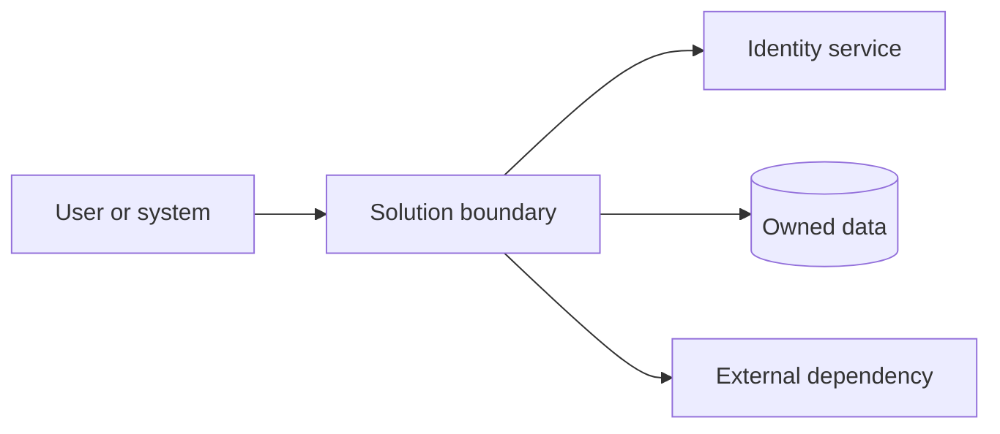

# Solution Architecture: {{SOLUTION_NAME}}

> Status: `Draft / Decision-ready / Approved / Superseded`
> Owner: {{ACCOUNTABLE_OWNER}}
> Last reviewed: `YYYY-MM-DD`

## 1. Decision Summary

<!-- State the business outcome, recommended architecture, and the few decisions that shape it. -->

## 2. Scope and Context

<!-- Define users, business capabilities, system boundary, in-scope and out-of-scope responsibilities. Include representative UX examples and confirmed assisted or alternate channels. Where channels share a case, identify the state owner and how a person resumes without repeating work. -->

### Representative UX examples

| Actor | Goal | Primary path | Alternate or assisted path | Accessibility and language considerations |
| :--- | :--- | :--- | :--- | :--- |
| | | | | |

```mermaid
flowchart LR
    User[User or system] --> Solution[Solution boundary]
    Solution --> Identity[Identity service]
    Solution --> Data[(Owned data)]
    Solution --> Dependency[External dependency]
```

## 3. Evidence, Assumptions, and Interview Record

| Topic | Evidence or assumption | Status | Owner | Review or decision date |
| :--- | :--- | :--- | :--- | :--- |
| | | `Confirmed / Provisional / Rejected / Blocked` | | |

## 4. Quality Attributes and Constraints

| Driver | Target or constraint | Priority | Evidence | Verification |
| :--- | :--- | :--- | :--- | :--- |
| Business criticality | | `Must / Should / Could` | | |
| Uptime | | `Must / Should / Could` | | |
| Recovery time objective (RTO) | | `Must / Should / Could` | | |
| Recovery point objective (RPO) | | `Must / Should / Could` | | |
| Data classification | | `Must / Should / Could` | | |
| Data retention and destruction | | `Must / Should / Could` | | |

For applicable services, describe any consequential automated decision and
the verified review path, derived or operational stores and third-party
processing, and cross-channel continuity or save-and-resume needs. Record
unknown authorities and operational commitments rather than treating them as
confirmed constraints.

## 5. Proposed Architecture

<!-- Describe deployment units, module or service boundaries, dependency direction, main workflows, data flows, and failure boundaries. Include separate Mermaid views when one diagram cannot communicate them clearly. -->

### Workflow and data flows

| From | Interaction | To | Data or decision | Failure or recovery |
| :--- | :--- | :--- | :--- | :--- |
| | | | | |

## 6. Technology Decisions, Defaults, and Fallbacks

| Decision | Preferred default considered | Selected option | Constraint or rationale | Fallback trigger and option | Consequence | Status |
| :--- | :--- | :--- | :--- | :--- | :--- | :--- |
| | | | | | | `Confirmed / Provisional / Rejected / Blocked` |

## 7. Identity and Access

| Population or workload | Authentication and assurance | Authorization and protected resources | Lifecycle and revocation | Outage or assisted path | Status |
| :--- | :--- | :--- | :--- | :--- | :--- |
| | | | | | `Confirmed / Provisional / Rejected / Blocked / N/A` |

## 8. Data, Integration, and Common Components

| Capability or flow | Owner and system of record | Contract and data purpose | Reuse decision | Failure, reconciliation, and recovery | Status |
| :--- | :--- | :--- | :--- | :--- | :--- |
| | | | | | `Confirmed / Provisional / Rejected / Blocked / N/A` |

### Decision review, information lifecycle, and channel continuity

Where software affects a person's outcome, distinguish process automation,
decision support, and automated decisions, including embedded vendor AI.
Identify the decision owner, approval or assessment status, safe reason/source
provenance, how a person learns of and challenges the result, who reviews it,
and how corrections reach downstream consumers. Mark unavailable approval or
human review capacity `Blocked` if it changes the design.

Inventory relevant stores (including caches, logs, search, analytics, backups,
and non-production copies) and material third-party processing. For each,
record classification, purpose, residency, source/steward where derived,
freshness and correction propagation, approved retention/disposition or legal
hold, and evidence or unresolved authority for collection and reuse. Where
Indigenous identity or community data is involved, identify the applicable
governance authority and requirements; do not infer them from language support.

If multiple digital or assisted channels are offered, describe the shared case
state, authorized resumption, confirmation rather than re-entry of lawfully
reusable facts, correction at the authoritative source, and a cross-channel
continuation test. For lengthy forms or unreliable connectivity, consider
save-and-resume without assuming offline synchronization is required.
Document `N/A` with a reason for any of these three concerns that do not apply.

## 9. Deployment and Operations

<!-- Define environments, hosting, network boundaries, delivery, observability, capacity, support, backup, recovery, and rollback. -->

## 10. Security, Privacy, Accessibility, and Language

<!-- Address threat boundaries, information classification, privacy, records, WCAG 2.2 AA, Unicode or UTF-8, Indigenous-language readiness, and required assurance or approvals. -->

## 11. Delivery and Evolution

<!-- Define increments, migrations, compatibility, deprecation, feature flags, reversibility, and measurable revisit triggers. -->

## 12. Decisions, Risks, and Open Questions

| ID | Type | Decision, risk, or question | Owner | Due or review date | Status |
| :--- | :--- | :--- | :--- | :--- | :--- |
| SA-001 | `Decision / Risk / Question` | | | | `Confirmed / Provisional / Rejected / Blocked` |

## 13. Sources and Freshness

| Source | Scope used | Authority or owner | Reviewed date | Confidence or limitation |
| :--- | :--- | :--- | :--- | :--- |
| | | | `YYYY-MM-DD` | |
